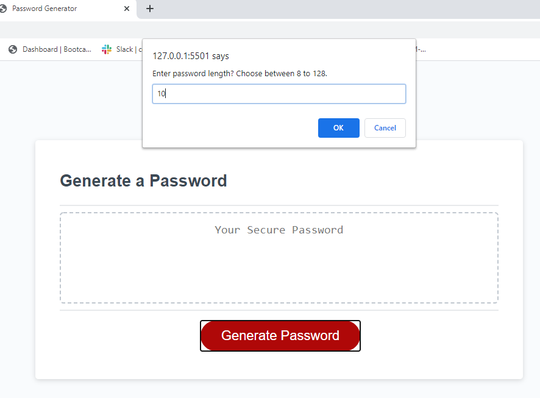
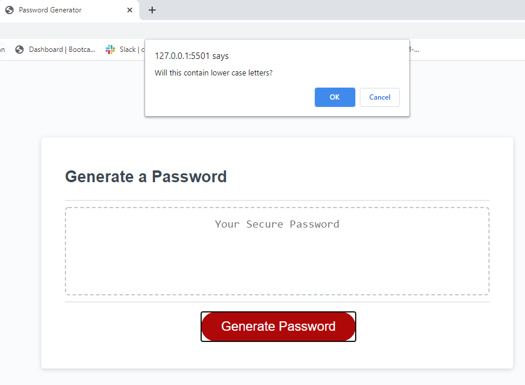
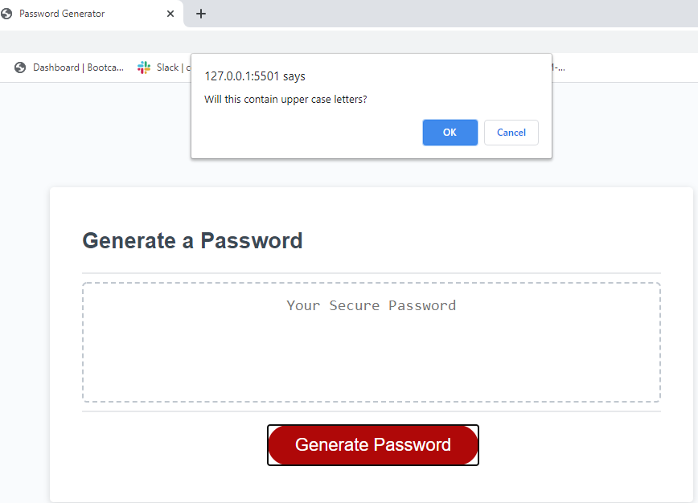
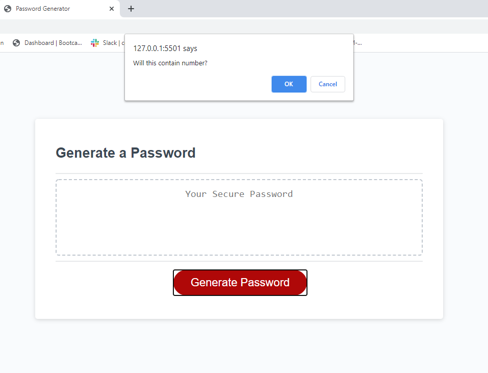
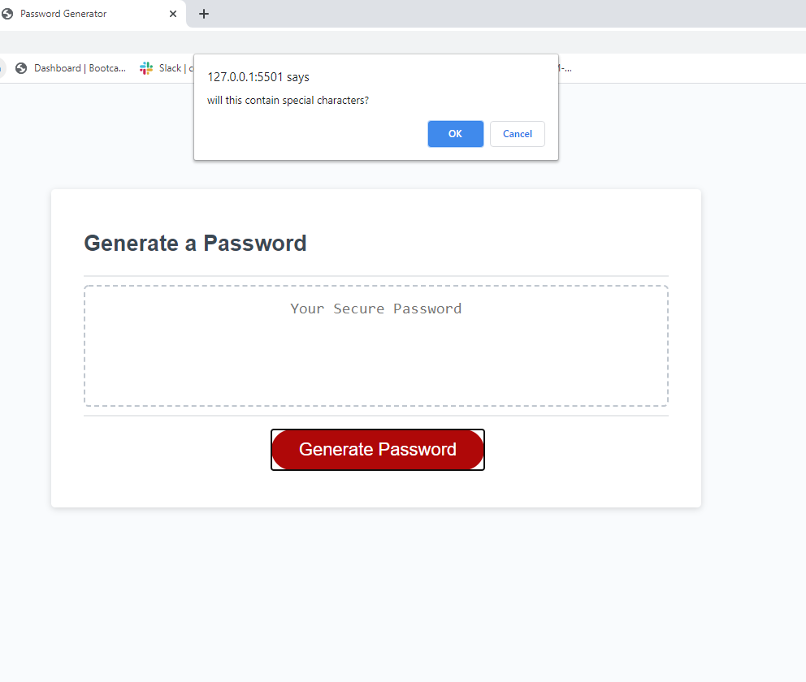
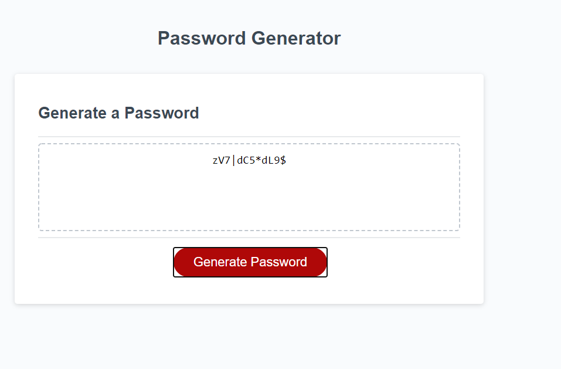

# Project Name: Password Generator

## Summary

HTML and CSS and Javascript documents create a random password generator.
This project emphasizes the use of using Javascript to make dynamic changes to an HMTL document

## Description

When generate password button is clicked.  
User will be presented with series of prompts for password criteria
(password length, lowercase, uppercase, numeric, and/or special characters)

### Prompt user for password length

### Confirm lowercase letters

### Confirm uppercase letters

### Confirm numbers

### Confirm Special Characters

This project validates password length.
This project validates at least one character type is selected.
password is generated that matches the selected criteria and written to the page

## Link

https://kannavairavan.github.io/HW3_PasswordGenerator/

## Repository

https://github.com/KannaVairavan/HW3_PasswordGenerator.git

## Technologies

Visual Studio code, HTML5, CSS and Javascript
